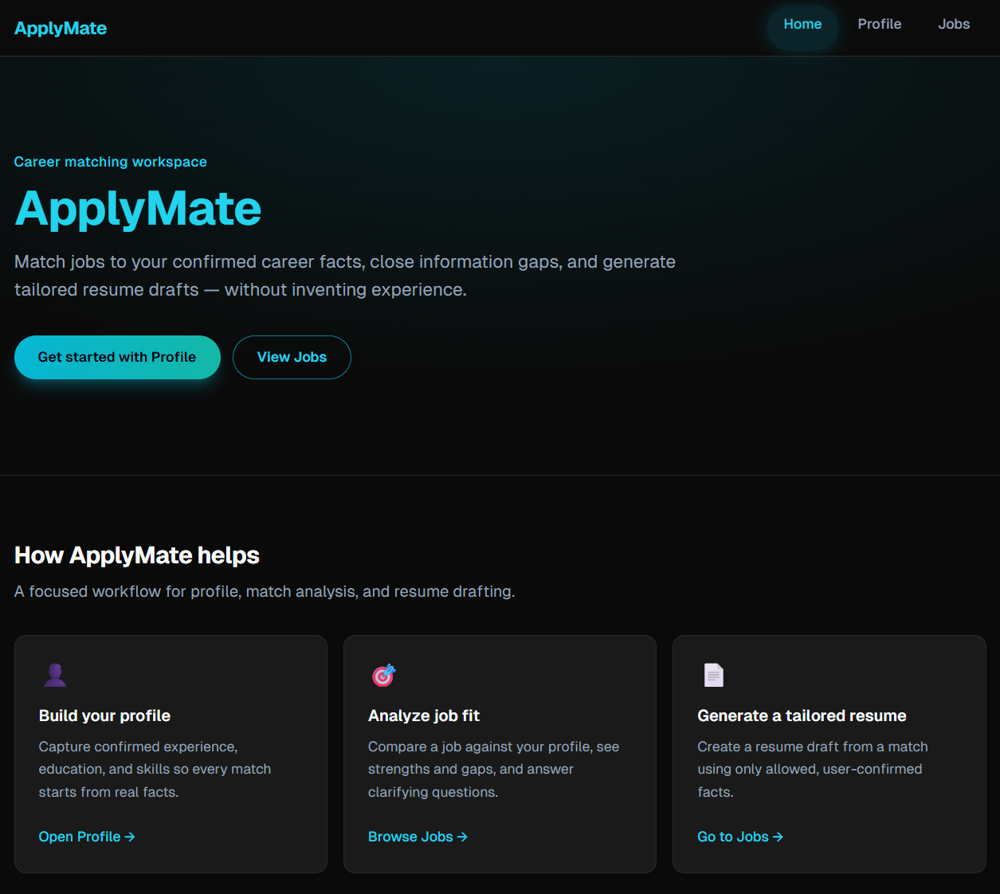

# ApplyMate



> A premium dark-themed, AI-powered career matching workspace that generates tailored resumes from confirmed facts.

ApplyMate helps users:

- create a career profile based on confirmed facts,
- analyze job descriptions,
- compare jobs with their profile,
- identify strengths and gaps,
- answer clarification questions,
- save additional career details,
- generate tailored resume drafts,
- export resumes as ATS-friendly HTML.

It is built as an open-core project: **ApplyMate Core** is the local/self-hosted MVP you can run today. **ApplyMate Cloud** is a planned hosted direction, not a shipped product.

## Current status

ApplyMate Core is an early-stage, **local-first**, **single-user** MVP. The main browser flow runs end to end:

**Profile → Job analysis → Match → Questions → Additional details → Resume generation → Resume preview → HTML download**

It is suitable for **local and private demos**. It is **not** production-ready for public SaaS.

There is no authentication, billing, credits, multi-user support, or PDF export in the current Core MVP.

## Open Core

### ApplyMate Core (available now)

ApplyMate Core is the local/self-hosted version. It currently includes:

- Premium dark responsive UI and global navigation
- Career profile with experience, education, and confirmed facts
- Job analysis from pasted text or URL
- Match scoring with strengths, gaps, and clarification questions
- Answered-question state and persistent answers after refresh
- Additional job-specific details saved as profile facts
- Tailored resume generation and ATS-friendly HTML export
- BYOK through environment variables
- SQLite for local development
- PostgreSQL as the intended future/production database target

ApplyMate Core does **not** currently include:

- Authentication
- Multi-tenancy / multi-user data isolation
- Credits
- Subscriptions
- Stripe
- Hosted database
- Admin panel
- Monitoring
- Gmail integration
- Telegram integration
- Automatic applications
- Real PDF export

Docker / self-hosted packaging is also not available yet. There is no `docker-compose` setup.

### ApplyMate Cloud (planned)

ApplyMate Cloud is a planned hosted direction. It may eventually offer:

- Hosted frontend
- Authentication
- Multi-user accounts
- PostgreSQL
- Credits and subscriptions
- Stripe billing
- Shared hosted AI provider
- Gmail / Telegram integrations
- Admin and monitoring

Cloud features are not implemented yet.

## What works today

- [x] Premium dark responsive UI
- [x] Global navigation
- [x] Career profile CRUD
- [x] Confirmed career facts
- [x] Experience and education management
- [x] Job analysis from pasted text
- [x] Job analysis from URL
- [x] AI match scoring
- [x] Strengths and gaps
- [x] Clarification questions
- [x] Answered question state
- [x] Persistent answers after refresh
- [x] Conflict handling for facts using `allowedInCv`
- [x] Additional job-specific details saved as profile facts
- [x] Match update/deduplication for the normal single-user MVP flow
- [x] Tailored resume generation
- [x] Resume GET payload
- [x] ATS-friendly HTML export/download
- [x] Zod validation for AI outputs and request bodies
- [x] OpenAI-compatible API endpoint support through `OPENAI_BASE_URL`
- [x] Local SQLite persistence

Match update/deduplication is implemented for the normal MVP flow (re-running Analyze Match updates the existing job/profile match when found). Concurrent uniqueness for matches and facts is still a production-hardening item.

## Core principles

- Do not invent experience, skills, or achievements.
- Prefer confirmed facts over guesses.
- Ask clarifying questions when important information is missing.
- Keep the workflow inspectable: profile, match, questions, then resume.
- Keep API keys server-side.
- Treat the match score as guidance, not a hiring probability.

## User flow

1. Create or update your career profile.
2. Add confirmed facts, experience, and education.
3. Analyze a job from pasted text or URL.
4. Review requirements and nice-to-have items.
5. Run match analysis.
6. Review score, strengths, gaps, and clarification questions.
7. Answer questions (saved as confirmed facts).
8. Optionally add additional job-specific details (also saved as profile facts).
9. Re-run match analysis manually when profile facts have changed.
10. Generate a tailored resume.
11. Preview the resume.
12. Download ATS-friendly HTML.

Answers and additional details are stored without an automatic new AI match call. A fresh Analyze Match runs only when the user requests it.

## Screens / features

| Area | What it does |
|------|----------------|
| Home (`/`) | Landing overview and entry points into the workflow |
| Profile (`/profile`) | Create and edit personal details, experience, education, and related facts |
| Jobs (`/jobs`) | Paste text or fetch a URL, then analyze requirements |
| Job detail (`/jobs/[id]`) | Review job data, run match analysis, answer questions, add details, generate a resume |
| Resume (`/resumes/[id]`) | Preview a tailored resume and download ATS-friendly HTML |

## Tech stack

- Next.js 14.2.35 (App Router)
- React 18
- TypeScript
- Tailwind CSS
- ESLint
- Prisma 6.19.3
- SQLite for local development
- OpenAI SDK against an OpenAI-compatible endpoint
- Zod
- Vercel as a possible hosting target after a PostgreSQL migration

Notes:

- The active AI model is `gpt-4o-mini`.
- `OPENAI_BASE_URL` is optional. If omitted, the default OpenAI endpoint is used.
- The API key is server-side only. Never expose it through a `NEXT_PUBLIC_` variable.
- Structured AI calls use the OpenAI SDK wrapper in `src/lib/ai/client.ts`, with Zod schemas in `src/lib/ai/schemas.ts`.

### Technical notes / future cleanup

These packages appear in `package.json` but are not used by the current application code path:

- `ai`
- `pdf-parse`
- `uuid`
- `dotenv`

They are candidates for a future dependency cleanup. They are not active product features.

## Project structure

```text
.github/
└── hero-screenshot.png

prisma/
└── schema.prisma

src/
├── app/
│   ├── fonts/
│   ├── layout.tsx
│   ├── page.tsx
│   ├── globals.css
│   ├── profile/
│   │   └── page.tsx
│   ├── jobs/
│   │   ├── page.tsx
│   │   └── [id]/
│   │       └── page.tsx
│   ├── resumes/
│   │   └── [id]/
│   │       └── page.tsx
│   └── api/
│       ├── profile/
│       │   └── route.ts
│       ├── jobs/
│       │   ├── route.ts
│       │   ├── analyze/
│       │   │   └── route.ts
│       │   └── [id]/
│       │       └── route.ts
│       ├── match/
│       │   ├── route.ts
│       │   ├── answer/
│       │   │   └── route.ts
│       │   └── details/
│       │       └── route.ts
│       └── resume/
│           ├── [id]/
│           │   └── route.ts
│           ├── generate/
│           │   └── route.ts
│           └── export/
│               └── route.ts
├── components/
│   ├── ui/
│   │   ├── AppHeader.tsx
│   │   ├── Button.tsx
│   │   ├── Card.tsx
│   │   ├── Input.tsx
│   │   ├── Badge.tsx
│   │   ├── ScoreCircle.tsx
│   │   └── LoadingSpinner.tsx
│   ├── jobs/
│   │   └── JobInput.tsx
│   ├── match/
│   │   ├── MatchReport.tsx
│   │   └── QuestionsPanel.tsx
│   └── resume/
│       └── ResumePreview.tsx
├── lib/
│   ├── ai/
│   │   ├── client.ts
│   │   └── schemas.ts
│   ├── pdf/
│   │   └── generate-pdf.ts
│   ├── db.ts
│   └── utils.ts
└── types/
    └── index.ts
```

`src/lib/pdf/generate-pdf.ts` currently generates ATS-friendly HTML. Despite the historical filename, it does not generate a real PDF.

## Frontend routes

| Route | Purpose |
|-------|---------|
| `/` | Home / landing |
| `/profile` | Career profile |
| `/jobs` | Job list and analyze input |
| `/jobs/[id]` | Job detail, match, questions, details, resume generation |
| `/resumes/[id]` | Resume preview and HTML download |

## API routes

| Method | Endpoint | Purpose |
|--------|----------|---------|
| `GET` / `POST` | `/api/profile` | Load or create/update the career profile |
| `GET` | `/api/jobs` | List analyzed jobs |
| `POST` | `/api/jobs/analyze` | Analyze a job from pasted text or URL |
| `GET` | `/api/jobs/[id]` | Fetch a single job and related match data |
| `POST` | `/api/match` | Run match analysis for a job against the profile |
| `POST` | `/api/match/answer` | Save a clarification answer as a confirmed fact |
| `POST` | `/api/match/details` | Save additional job-specific details as a profile fact |
| `POST` | `/api/resume/generate` | Generate a tailored resume for a match |
| `GET` | `/api/resume/[id]` | Fetch a generated resume |
| `POST` | `/api/resume/export` | Export/download the resume as HTML |

## Data model

Prisma models currently used:

- **Profile** — personal details and relations to facts, experience, education, matches, and resumes
- **Fact** — confirmed or inferred career facts used during matching and resume generation
- **Experience** — work history entries
- **Education** — education entries
- **Job** — raw description plus extracted requirements
- **Match** — score, strengths, gaps, questions, and recommendation
- **Resume** — tailored resume content linked to a match/job/profile

Local persistence uses SQLite via `DATABASE_URL`.

## Getting started

1. Clone the repository:

```bash
git clone git@github.com:ChrisKariofyllis/ApplyMate.git
cd ApplyMate
```

2. Install dependencies:

```bash
npm install
```

3. Create a local `.env.local` file with placeholders only:

```env
OPENAI_API_KEY=your-api-key-here
OPENAI_BASE_URL=https://your-openai-compatible-provider.example/v1
DATABASE_URL="file:./dev.db"
```

4. Set up the local database:

```bash
npx prisma generate
npx prisma db push
```

5. Run the app:

```bash
npm run dev
```

6. Open:

```text
http://localhost:3000
```

Do **not** commit `.env.local`, real API keys, or the local `dev.db` file.

Useful scripts:

```bash
npm run dev
npm run build
npm run start
npm run lint
npx prisma generate
npx prisma db push
npx prisma studio
```

## Environment variables

| Variable | Required | Purpose |
|----------|----------|---------|
| `DATABASE_URL` | Yes | SQLite connection string for local development |
| `OPENAI_API_KEY` | Yes (for AI features) | Server-side API key for the OpenAI-compatible provider |
| `OPENAI_BASE_URL` | No | Optional OpenAI-compatible base URL. If omitted, the default OpenAI endpoint is used |

Details:

- Use the provider's documented base URL.
- If the provider documents `/v1/chat/completions`, set the base URL to the `/v1` part.
- Never commit `.env` or `.env.local`.
- Never expose the API key through a `NEXT_PUBLIC_` variable.
- Keep `DATABASE_URL` consistent between the Prisma CLI and the Next.js runtime.

## Local development

1. Install dependencies with `npm install`.
2. Create `.env.local` with the placeholders above.
3. Generate the Prisma client with `npx prisma generate`.
4. Create/update the local SQLite schema with `npx prisma db push`.
5. Start the app with `npm run dev`.
6. Use `npx prisma studio` if you want to inspect local data.

AI calls go through the server-side OpenAI-compatible client in `src/lib/ai/client.ts`. Responses are validated with Zod schemas in `src/lib/ai/schemas.ts`.

## Quality and verification

Before opening a pull request, run:

```bash
npm run lint
npm run build
```

The Core MVP has been verified through the local/private demo browser flow (profile → job → match → questions/details → resume → HTML download).

There is no full automated test suite yet.

## Vercel and production notes

- Vercel can host the Next.js application.
- SQLite should not be used as persistent production storage on Vercel.
- Before production, migrate Prisma from SQLite to PostgreSQL.
- Possible providers: Supabase, Neon, Railway, or another PostgreSQL provider.
- Add `DATABASE_URL`, `OPENAI_API_KEY`, and optionally `OPENAI_BASE_URL` to Vercel environment variables.
- Authentication, multi-tenancy, rate limiting, and SSRF protection are required before a public deployment.
- The current project is suitable for local/private demo use, not an unrestricted public SaaS deployment.

## Privacy and security

- Career profiles and resumes may contain sensitive personal information.
- API keys stay server-side.
- Do not commit secrets.
- Review generated resumes before using them.
- Do not treat the match score as a hiring probability.
- Do not use this tool for employer-side automated hiring decisions.
- Public deployment requires authentication, rate limiting, SSRF protection, and a production database.
- Check the AI provider's commercial-use and data-retention terms before using it as part of a paid cloud service.

## Current limitations

### MVP scope limitations

These are intentional limits of the current Core MVP:

- Single-user profile model (uses the first profile).
- No authentication.
- No multi-user data isolation.
- SQLite is intended for local development/demo, not persistent Vercel production storage.
- HTML export is implemented; real PDF generation is not implemented.
- No credits, billing, or Stripe.
- No monitoring, backups, or delete-my-data flow.
- Answers and additional details are saved as facts without an automatic re-score; the user must re-run Analyze Match manually.
- AI provider/API availability depends on the configured OpenAI-compatible endpoint.

### Before public deployment

These items should be addressed before exposing ApplyMate publicly:

- PostgreSQL (or another production database) instead of SQLite on ephemeral hosts.
- Authentication and multi-user data isolation.
- Rate limiting, quotas, and AI cost controls.
- SSRF hardening and URL fetch limits for job URL analysis.
- Stronger concurrency-safe uniqueness for matches and facts.
- Hard limits for stored job descriptions and answer lengths.
- Improved multi-tab consistency around profile fact replacement.
- Observability (logging/monitoring) and a privacy/delete-data flow.

## Roadmap

### Completed

- [x] Core browser flow
- [x] Premium dark UI foundation
- [x] Match questions and answered state
- [x] Additional details persistence
- [x] Fact conflict archiving via `allowedInCv`
- [x] Match update/deduplication for the normal MVP flow
- [x] HTML resume export

### Next priorities

1. SSRF protection and URL fetch limits
2. Hard limits for stored job descriptions and answer lengths
3. Stronger concurrency-safe uniqueness for matches and facts
4. Remove stale facts from client profile replacement flow / improve multi-tab consistency
5. PostgreSQL migration for production
6. Authentication and multi-user data isolation
7. Rate limiting, quotas, and AI cost controls
8. Credits and billing
9. Real PDF export
10. Docker / self-hosted deployment

### Later / optional

- [ ] Automated tests
- [ ] Rename the historical `generate-pdf.ts` helper to an HTML-specific name
- [ ] DOCX export
- [ ] Resume version history
- [ ] More complete BYOK / provider configuration
- [ ] Additional AI providers
- [ ] Local model support
- [ ] Gmail integration
- [ ] Telegram integration
- [ ] Admin tools

## Contributing

This is still an early Core MVP. Useful contributions are small, focused changes that improve reliability, clarity, or safety.

Before opening a pull request:

1. Run `npm run lint`
2. Run `npm run build`
3. Keep the change scoped
4. Do not commit secrets or local database files

## Author

Created by Chris Kariofyllis

- GitHub: https://github.com/ChrisKariofyllis
- Personal website: https://www.chriskariofyllis.com/

## License

License: The licensing terms are not finalized yet.

If you are trying ApplyMate Core locally, start with a real profile and one job posting, then walk the full flow once before changing anything.
